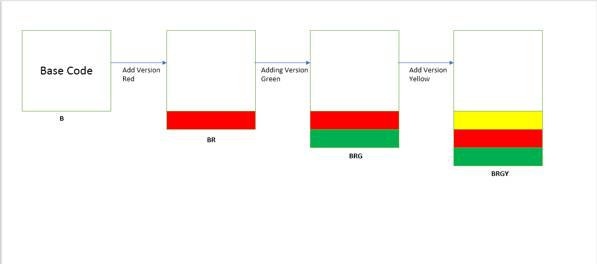

# Code_Versioning                                                                                           

## The Problem
Each time a new requirment or change comes to a code logic, we tend to create a separate version of the code. For each new change we have a seperate code for it. If lot of changes have come then it becomes really difficult to keep track of all the code files. At the end we are scratching our head in front of diffrent codes we have lost track of.

We have just added 3 modifications to our base code and we have end up with 4 different codes. The space requried with this method is directly related to number of versions. This method doesn't cover all the cases. If requirement comes to run only BRY then new version needs to be created which whould look like

## The Solution
Code Versioning will be very useful for maintaining different code logic inside a single program. If all the code logic is present in single code it becomes very easy to keep track of previous changes made as well as very less  disk space will be used by the program. Before executing the actual code just pass the code file to this program along with the versions which should be picked. The code versioning program will create the final code which can be executed.

